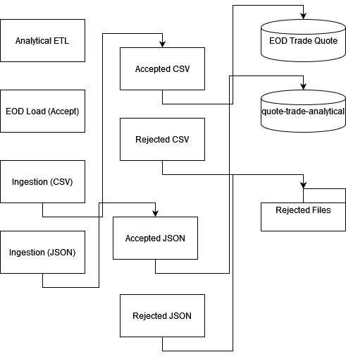

# Equity-Market-Data-Analysis

This repository contains a complete end-to-end data engineering pipeline for ingesting, processing, and analyzing equity market data using PySpark on Azure Databricks. The project simulates a real-world scenario of handling high-volume stock trade and quote data using distributed systems and cloud-native tools.

## Project Structure


## Step 1: Design and Architecture

- Created a pipeline design that processes semi-structured trade and quote data from text files
- Defined clear staging and analytical zones for the data lake
- Architecture is illustrated in `Drawio.drawio.png`
  


## Step 2: Data Ingestion and Normalization

- Used PySpark to parse raw files with mixed schema (T = Trade, Q = Quote)
- Created a unified schema and logic to cast data types and filter malformed records
- Wrote outputs into partitioned directories based on record type

- 
## Step 3: End-of-Day (EOD) Load

- Removed duplicates by selecting records with the latest `arrival_tm` using a window function
- Casted and validated quote and trade tables
- Wrote cleaned data back to Azure Blob Storage in EOD format:

## Step 4: Analytical ETL

- Computed 30-minute moving average using Spark SQL and window functions
- Forward-filled `trade_pr` and `mov_avg_pr` into quote records
- Joined with the prior day close price table using broadcast join
- Enriched quotes with:
- `latest_trade_pr`
- `latest_mov_avg_pr`
- `bid_pr_mv = bid_pr - close_pr`
- `ask_pr_mv = ask_pr - close_pr`
- Final result saved as `quote_final` table or Parquet output

## Step 5: Automation and Reporting

- Created `tracker.py` to log job status to Azure Blob Storage
- `run_data_ingestion.py` and `run_reporter.py` scripts use Tracker class to:
- Assign job ID
- Update job status (success/failure)
- Store updates in `job_tracker.json`
- Config file: `config.ini`

### Sample `config.ini`

```ini
[azure]
storage_account_name = trial25
container_name = equity-data
eod_directory = wasbs://equity-data@trial25.blob.core.windows.net/eod

[job_tracking]
storage_container = equity-data
tracking_file = job_tracker.json

[production]
processing_date = 2020-08-06


