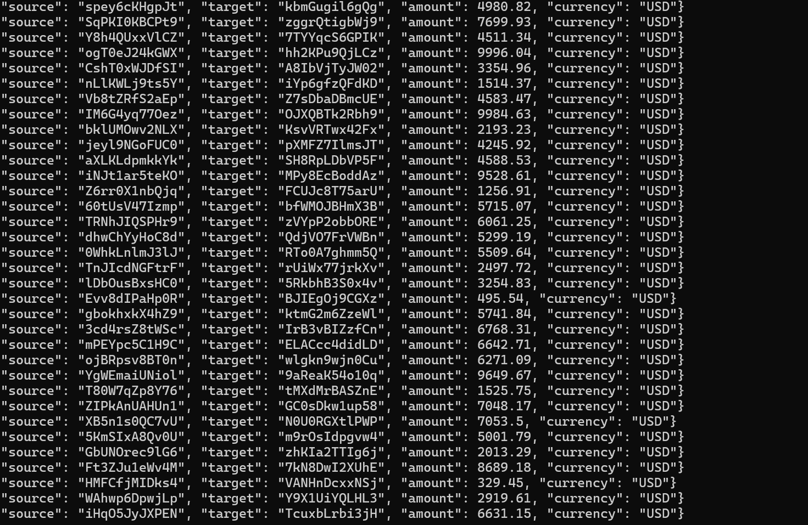

# Kafka Streaming Fraud Detection System

A real-time fraud detection system built with **Apache Kafka** and **Python**. It processes streaming transactions, classifies them as **legit** or **fraudulent**, and outputs the results into separate Kafka topics.

---

## Description

This project simulates a **real-time fraud detection pipeline** using Kafka's **producer-consumer** model. A **Transaction Generator** continuously creates random transactions, which are then processed by the **Fraud Detector**. Transactions exceeding a threshold (e.g., **$900**) are flagged as fraudulent and stored in a dedicated Kafka topic.

**Key Features**:
- **Kafka Cluster** (Zookeeper & Broker)
- **Transaction Generator** (Producer)
- **Fraud Detector** (Consumer + Producer)
- **Kafka Topics** for Legitimate and Fraudulent Transactions

---

## Getting Started

### Dependencies

Ensure you have the following installed:
- **Docker & Docker Compose**
- **Python 3.6+** with `kafka-python`
- **Kafka & Zookeeper** running

### Installing

1. **Clone the repository**
```sh
git clone https://github.com/your-github/kafka-fraud-detection.git
cd kafka-fraud-detection

## Screenshots

### Transactions Generated


### Legit Transactions


### Fraud Transactions


