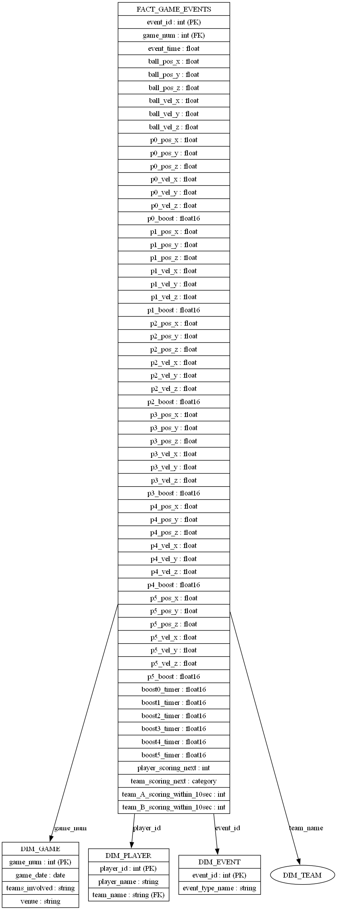
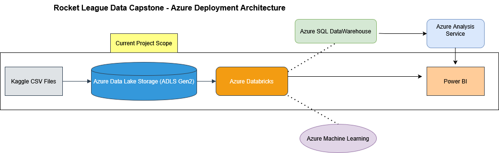

## README: Rocket League Data Pipeline Capstone Project

### Project Overview
The Rocket League Data Pipeline Capstone Project is designed to analyze Rocket League match data to assess player performance, game dynamics, and team strategies. It involves building a scalable and production-grade data pipeline using Azure services and PySpark, enabling real-time analytics and monitoring capabilities.

---

### Dataset and Its Characteristics
- **Source Format**: Multiple CSV files
- **Location**: Ingested into Azure Data Lake Storage (ADLS Gen2)
- **Schema Highlights**:
  - `event_time`: Timestamp of each game event
  - `ball_pos_x`, `ball_pos_y`, `ball_pos_z`: Ball position coordinates
  - `p0_pos_x` to `p5_boost`: Player positions, velocities, and boost info
  - `player_scoring_next`, `team_scoring_next`: Labels for prediction
- **Volume**: Scalable to millions of rows per match logs
- **Issues**: Nulls, data type inconsistencies, duplicate entries

---

### Final Pipeline Components & Rationale
| Component | Technology | Rationale |
|-----------|------------|-----------|
| Ingestion | Azure Blob Storage / ADLS Gen2 | Scalable, cloud-based storage |
| Processing | Azure Databricks (PySpark) | Distributed compute for large-scale processing |
| Transformation | PySpark DataFrame APIs | Efficient in-memory transformations |
| Storage | Parquet in Blob Storage | Columnar, optimized for analytics |
| Monitoring | Azure Log Analytics + Dashboard | Real-time monitoring of pipeline health |
| Security | `.env` for credentials | Separation of config from code |
| Unit Testing | `unittest`, sample datasets | Validates transformations and writes |

---

### Pipeline Stages
#### 1. Data Acquisition
- Reads multiple CSV files from Azure Blob using wildcard pattern
- Uses Spark schema inference for flexible loading

#### 2. Data Cleansing
- Drops duplicates and nulls
- Converts `event_time` to `timestamp`
- Casts columns to appropriate types using Spark's `withColumn().cast()`

#### 3. Feature Engineering
- Derived metrics like average player speed, player distance to ball

#### 4. Data Storage
- Writes cleansed data as partitioned Parquet to Azure Blob
- Partitioned by `game_num` for better query performance

#### 5. Monitoring and Logging
- Appends metrics (row counts, columns) to a `.log` file in blob storage
- Logged to Log Analytics and visualized in Azure Dashboard

#### 6. Unit Testing
- Tests for data loading, cleaning, type conversion, and Parquet writing
- Uses a small test CSV in blob to validate against expected schema

#### 7. Production Deployment
- Final code moved to standalone `.py` script
- `.env` file created for secure key storage
- Data pipeline runs in a Databricks notebook or job

---

### Entity-Relationship Diagram
```md
)
```

---

### Azure Architecture Diagram
```

```

---

### Final Dashboard Snapshot & Metrics
**Dashboard Title**: Monitor Rocket League DataPipeline

**Metrics Visualized**:
- PutBlob Operations (file writes over time)
- Notebook Runs (pipeline executions)
- Cluster Events (Databricks lifecycle tracking)
- Availability of storage services
- Query Counts (dashboard usage)

All visuals created using Kusto Query Language (KQL) and pinned to Azure Dashboards.

---

### Additional Highlights
- Transitioned from a pandas prototype to scalable PySpark code
- Improved storage via columnar format (Parquet)
- Implemented config separation using `config.env`
- Adopted best practices for unit testing and secure secret management

---

### Next Steps (Beyond Capstone)
- Schedule the pipeline via Azure Data Factory or Job Scheduler
- Integrate with Power BI for dynamic business dashboards
- Add predictive modeling (e.g., player win probability)
- Expand schema to include more advanced gameplay events (e.g., passes, boosts used)

